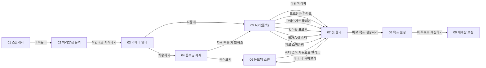
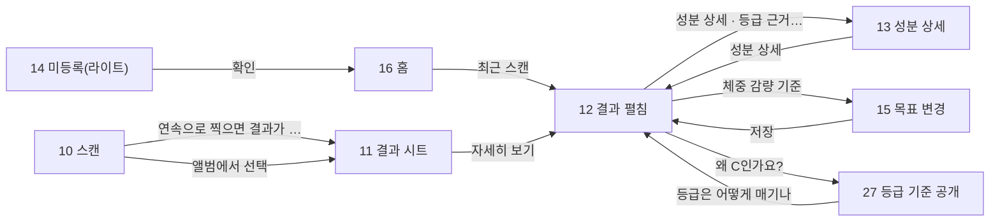
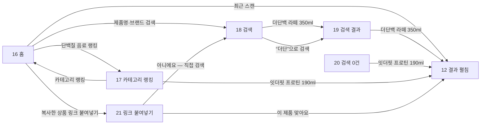
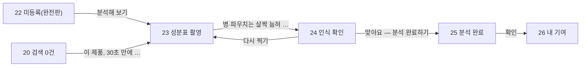
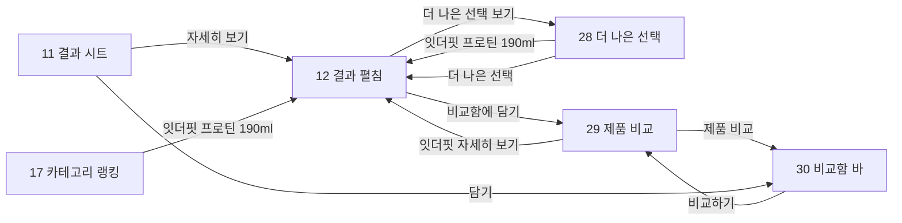
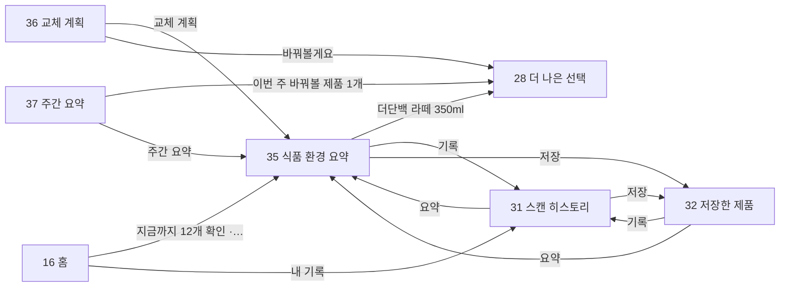
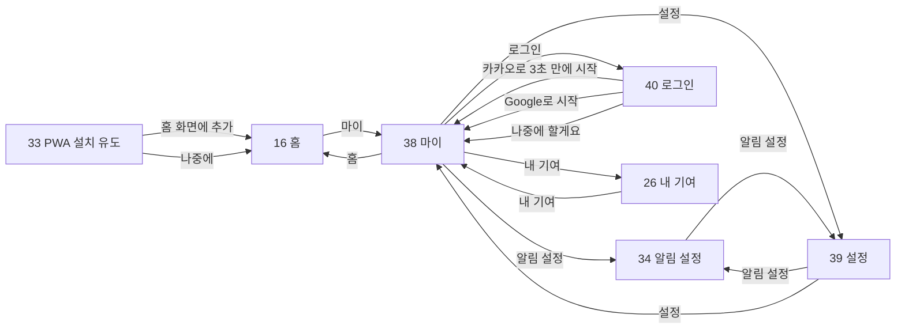

# 화면 플로우 · 인터랙션 명세

> 시안 40화면이 **어떤 순서로 이어지고, 어떤 요소를 누르면 어디로 가는지**의 단일 원본.
> 클릭 체험: 프로토타입 링크 참조 · 화면 이미지: [[IA 화면정의서 최종본]] 및 저장소 `docs/design/`
> 배선 총 97건 / 화면 40개.

## 1. 플로우 맵

### 온보딩 — 첫 방문 2분

### 스캔 → 결과 (핵심 루프)

### 탐색 — 검색·랭킹·링크

### 데이터 기여

### 비교 · 대안

### 재방문 · 내 기록

### 설정 · 계정

## 2. 인터랙션 명세 — 화면별 클릭 지점

### 1차 · 온보딩·스캔·결과

**01 스플래시**

| 누르는 것 | 이동 | 비고 |
| --- | --- | --- |
| 마이뉴티 | 02 처리방침 동의 | 자동 진행 (2초) |

**02 처리방침 동의**

| 누르는 것 | 이동 | 비고 |
| --- | --- | --- |
| 확인하고 시작하기 | 03 카메라 안내 |  |
| 개인정보 처리방침 전문 보기 | 02 처리방침 동의 | 외부 문서 |

**03 카메라 안내**

| 누르는 것 | 이동 | 비고 |
| --- | --- | --- |
| 허용하기 | 04 온보딩 시작 | OS 권한 허용 후 |
| 나중에 | 05 픽커(폴백) | 권한 없이 폴백 |

**04 온보딩 시작**

| 누르는 것 | 이동 | 비고 |
| --- | --- | --- |
| 찍어보기 | 06 온보딩 스캔 |  |
| 지금 찍을 게 없어요 | 05 픽커(폴백) |  |

**05 픽커(폴백)**

| 누르는 것 | 이동 | 비고 |
| --- | --- | --- |
| 더단백 라떼 | 07 첫 결과 | 카드 선택 |
| 프로틴바 카카오 | 07 첫 결과 | 카드 선택 |
| 그릭요거트 플레인 | 07 첫 결과 |  |
| 잇더핏 프로틴 | 07 첫 결과 |  |
| 닭가슴살 스팀 | 07 첫 결과 |  |
| 제로 스파클링 | 07 첫 결과 |  |

**06 온보딩 스캔**

| 누르는 것 | 이동 | 비고 |
| --- | --- | --- |
| 셔터 없이 자동으로 인식돼요 | 07 첫 결과 | 바코드 인식 성공 시 자동 |

**07 첫 결과**

| 누르는 것 | 이동 | 비고 |
| --- | --- | --- |
| 하나 더 찍어보기 | 06 온보딩 스캔 |  |
| 바로 목표 설정하기 | 08 목표 설정 |  |
| 성분 상세 · 등급 근거 보기 | 13 성분 상세 |  |

**08 목표 설정**

| 누르는 것 | 이동 | 비고 |
| --- | --- | --- |
| 이 목표로 계산하기 | 09 재계산 보상 |  |
| 건너뛰기 — 일반 기준으로 볼게요 | 16 홈 | 일반 기준으로 홈 직행 |

**09 재계산 보상**

| 누르는 것 | 이동 | 비고 |
| --- | --- | --- |
| 홈으로 | 16 홈 | 온보딩 완료 |

**10 스캔**

| 누르는 것 | 이동 | 비고 |
| --- | --- | --- |
| 연속으로 찍으면 결과가 바로 바뀌어요 | 11 결과 시트 | 바코드 인식 성공 |
| 직접 검색 | 18 검색 |  |
| 앨범에서 선택 | 11 결과 시트 |  |

**11 결과 시트**

| 누르는 것 | 이동 | 비고 |
| --- | --- | --- |
| 자세히 보기 | 12 결과 펼침 |  |
| 담기 | 30 비교함 바 | 비교함에 추가 |

**12 결과 펼침**

| 누르는 것 | 이동 | 비고 |
| --- | --- | --- |
| 성분 상세 · 등급 근거 보기 | 13 성분 상세 |  |
| 더 나은 선택 보기 | 28 더 나은 선택 | C·D·E 등급만 |
| 비교함에 담기 | 29 제품 비교 |  |
| 체중 감량 기준 | 15 목표 변경 | 목표 칩 |
| 왜 C인가요? | 27 등급 기준 공개 |  |

**13 성분 상세**

| 누르는 것 | 이동 | 비고 |
| --- | --- | --- |
| 성분 상세 | 12 결과 펼침 | ← 뒤로 |

**14 미등록(라이트)**

| 누르는 것 | 이동 | 비고 |
| --- | --- | --- |
| 확인 | 16 홈 |  |

**15 목표 변경**

| 누르는 것 | 이동 | 비고 |
| --- | --- | --- |
| 저장 | 12 결과 펼침 | 등급 재계산 후 복귀 |
| 목표 설정 | 38 마이 | ← 뒤로 |

### 2차 · 탐색·기여

**16 홈**

| 누르는 것 | 이동 | 비고 |
| --- | --- | --- |
| 최근 스캔 | 12 결과 펼침 | 제품 행 탭 |
| 단백질 음료 랭킹 | 17 카테고리 랭킹 |  |
| 지금까지 12개 확인 · 평균 C | 35 식품 환경 요약 |  |
| 제품명·브랜드 검색 | 18 검색 |  |
| 복사한 상품 링크 붙여넣기 | 21 링크 붙여넣기 |  |
| 내 기록 | 31 스캔 히스토리 | 탭바 |
| 마이 | 38 마이 | 탭바 |

**17 카테고리 랭킹**

| 누르는 것 | 이동 | 비고 |
| --- | --- | --- |
| 잇더핏 프로틴 190ml | 12 결과 펼침 | 제품 행 탭 |
| 선정 기준 | 27 등급 기준 공개 |  |
| 카테고리 랭킹 | 16 홈 | ← 뒤로 |

**18 검색**

| 누르는 것 | 이동 | 비고 |
| --- | --- | --- |
| 더단백 라떼 350ml | 19 검색 결과 | 자동완성 선택 |
| “더단”으로 검색 | 19 검색 결과 |  |

**19 검색 결과**

| 누르는 것 | 이동 | 비고 |
| --- | --- | --- |
| 더단백 라떼 350ml | 12 결과 펼침 | 결과 행 탭 |

**20 검색 0건**

| 누르는 것 | 이동 | 비고 |
| --- | --- | --- |
| 이 제품, 30초 만에 분석해 볼까요? | 23 성분표 촬영 |  |
| 잇더핏 프로틴 190ml | 12 결과 펼침 | 대안 제품 |
| 찾는 제품 알려주기 (선택) | 20 검색 0건 | 제보 폼 |

**21 링크 붙여넣기**

| 누르는 것 | 이동 | 비고 |
| --- | --- | --- |
| 이 제품 맞아요 | 12 결과 펼침 |  |
| 아니에요 — 직접 검색 | 18 검색 |  |

**22 미등록(완전판)**

| 누르는 것 | 이동 | 비고 |
| --- | --- | --- |
| 분석해 보기 | 23 성분표 촬영 |  |
| 나중에 | 16 홈 |  |

**23 성분표 촬영**

| 누르는 것 | 이동 | 비고 |
| --- | --- | --- |
| 병·파우치는 살짝 눕혀 찍으면 반사가 줄어요 | 24 인식 확인 | 촬영 후 |

**24 인식 확인**

| 누르는 것 | 이동 | 비고 |
| --- | --- | --- |
| 맞아요 — 분석 완료하기 | 25 분석 완료 |  |
| 다시 찍기 | 23 성분표 촬영 |  |

**25 분석 완료**

| 누르는 것 | 이동 | 비고 |
| --- | --- | --- |
| 확인 | 26 내 기여 |  |

**26 내 기여**

| 누르는 것 | 이동 | 비고 |
| --- | --- | --- |
| 내 기여 | 38 마이 | ← 뒤로 |

**27 등급 기준 공개**

| 누르는 것 | 이동 | 비고 |
| --- | --- | --- |
| 등급은 어떻게 매기나 | 12 결과 펼침 | ← 뒤로 |

### 3차 · 비교·재방문

**28 더 나은 선택**

| 누르는 것 | 이동 | 비고 |
| --- | --- | --- |
| 잇더핏 프로틴 190ml | 12 결과 펼침 | 대안 제품 탭 |
| 더 나은 선택 | 12 결과 펼침 | ← 뒤로 |

**29 제품 비교**

| 누르는 것 | 이동 | 비고 |
| --- | --- | --- |
| 잇더핏 자세히 보기 | 12 결과 펼침 |  |
| 비교 링크 공유하기 | 29 제품 비교 | 공유 시트 |
| 제품 비교 | 30 비교함 바 | ← 뒤로 |

**30 비교함 바**

| 누르는 것 | 이동 | 비고 |
| --- | --- | --- |
| 비교하기 | 29 제품 비교 |  |
| 카테고리 랭킹 | 16 홈 | ← 뒤로 |

**31 스캔 히스토리**

| 누르는 것 | 이동 | 비고 |
| --- | --- | --- |
| 더단백 라떼 350ml | 12 결과 펼침 | 기록 행 탭 |
| 요약 | 35 식품 환경 요약 | 세그먼트 |
| 저장 | 32 저장한 제품 | 세그먼트 |

**32 저장한 제품**

| 누르는 것 | 이동 | 비고 |
| --- | --- | --- |
| 잇더핏 프로틴 190ml | 12 결과 펼침 |  |
| 요약 | 35 식품 환경 요약 | 세그먼트 |
| 기록 | 31 스캔 히스토리 | 세그먼트 |

**33 PWA 설치 유도**

| 누르는 것 | 이동 | 비고 |
| --- | --- | --- |
| 홈 화면에 추가 | 16 홈 | 설치 후 |
| 나중에 | 16 홈 |  |

**34 알림 설정**

| 누르는 것 | 이동 | 비고 |
| --- | --- | --- |
| 알림 설정 | 39 설정 | ← 뒤로 |

### 4차 · 식품 환경

**35 식품 환경 요약**

| 누르는 것 | 이동 | 비고 |
| --- | --- | --- |
| 더단백 라떼 350ml | 28 더 나은 선택 | 교체 후보 → 대안 |
| 기록 | 31 스캔 히스토리 | 세그먼트 |
| 저장 | 32 저장한 제품 | 세그먼트 |
| 로그인 | 40 로그인 |  |

**36 교체 계획**

| 누르는 것 | 이동 | 비고 |
| --- | --- | --- |
| 교체 계획 | 35 식품 환경 요약 | ← 뒤로 |
| 바꿔볼게요 | 28 더 나은 선택 |  |

**37 주간 요약**

| 누르는 것 | 이동 | 비고 |
| --- | --- | --- |
| 이번 주 바꿔볼 제품 1개 | 28 더 나은 선택 |  |
| 주간 요약 | 35 식품 환경 요약 | ← 뒤로 |

### 공통

**38 마이**

| 누르는 것 | 이동 | 비고 |
| --- | --- | --- |
| 내 기여 | 26 내 기여 |  |
| 등급은 어떻게 매기나 | 27 등급 기준 공개 |  |
| 알림 설정 | 34 알림 설정 |  |
| 설정 | 39 설정 |  |
| 로그인 | 40 로그인 |  |
| 홈 | 16 홈 | 탭바 |
| 내 기록 | 31 스캔 히스토리 | 탭바 |

**39 설정**

| 누르는 것 | 이동 | 비고 |
| --- | --- | --- |
| 알림 설정 | 34 알림 설정 |  |
| 목표 설정 | 15 목표 변경 |  |
| 설정 | 38 마이 | ← 뒤로 |

**40 로그인**

| 누르는 것 | 이동 | 비고 |
| --- | --- | --- |
| 카카오로 3초 만에 시작 | 38 마이 | 로그인 완료 |
| Google로 시작 | 38 마이 |  |
| 나중에 할게요 | 38 마이 |  |

## 3. 역방향 — 이 화면으로 오는 경로

| 화면 | 진입 경로 |
| --- | --- |
| 01 스플래시 | **진입점** |
| 02 처리방침 동의 | 01 스플래시 |
| 03 카메라 안내 | 02 처리방침 동의 |
| 04 온보딩 시작 | 03 카메라 안내 |
| 05 픽커(폴백) | 03 카메라 안내 · 04 온보딩 시작 |
| 06 온보딩 스캔 | 04 온보딩 시작 · 07 첫 결과 |
| 07 첫 결과 | 05 픽커(폴백) · 06 온보딩 스캔 |
| 08 목표 설정 | 07 첫 결과 |
| 09 재계산 보상 | 08 목표 설정 |
| 10 스캔 | **진입점** |
| 11 결과 시트 | 10 스캔 |
| 12 결과 펼침 | 11 결과 시트 · 13 성분 상세 · 15 목표 변경 · 16 홈 · 17 카테고리 랭킹 · 19 검색 결과 · 20 검색 0건 · 21 링크 붙여넣기 · 27 등급 기준 공개 · 28 더 나은 선택 · 29 제품 비교 · 31 스캔 히스토리 · 32 저장한 제품 |
| 13 성분 상세 | 07 첫 결과 · 12 결과 펼침 |
| 14 미등록(라이트) | **진입점** |
| 15 목표 변경 | 12 결과 펼침 · 39 설정 |
| 16 홈 | 08 목표 설정 · 09 재계산 보상 · 14 미등록(라이트) · 17 카테고리 랭킹 · 22 미등록(완전판) · 30 비교함 바 · 33 PWA 설치 유도 · 38 마이 |
| 17 카테고리 랭킹 | 16 홈 |
| 18 검색 | 10 스캔 · 16 홈 · 21 링크 붙여넣기 |
| 19 검색 결과 | 18 검색 |
| 20 검색 0건 | **진입점** |
| 21 링크 붙여넣기 | 16 홈 |
| 22 미등록(완전판) | **진입점** |
| 23 성분표 촬영 | 20 검색 0건 · 22 미등록(완전판) · 24 인식 확인 |
| 24 인식 확인 | 23 성분표 촬영 |
| 25 분석 완료 | 24 인식 확인 |
| 26 내 기여 | 25 분석 완료 · 38 마이 |
| 27 등급 기준 공개 | 12 결과 펼침 · 17 카테고리 랭킹 · 38 마이 |
| 28 더 나은 선택 | 12 결과 펼침 · 35 식품 환경 요약 · 36 교체 계획 · 37 주간 요약 |
| 29 제품 비교 | 12 결과 펼침 · 30 비교함 바 |
| 30 비교함 바 | 11 결과 시트 · 29 제품 비교 |
| 31 스캔 히스토리 | 16 홈 · 32 저장한 제품 · 35 식품 환경 요약 · 38 마이 |
| 32 저장한 제품 | 31 스캔 히스토리 · 35 식품 환경 요약 |
| 33 PWA 설치 유도 | **진입점** |
| 34 알림 설정 | 38 마이 · 39 설정 |
| 35 식품 환경 요약 | 16 홈 · 31 스캔 히스토리 · 32 저장한 제품 · 36 교체 계획 · 37 주간 요약 |
| 36 교체 계획 | **진입점** |
| 37 주간 요약 | **진입점** |
| 38 마이 | 15 목표 변경 · 16 홈 · 26 내 기여 · 39 설정 · 40 로그인 |
| 39 설정 | 34 알림 설정 · 38 마이 |
| 40 로그인 | 35 식품 환경 요약 · 38 마이 |

관련: [[IA 화면정의서 최종본]] · [[00 영양대학 홈]]
